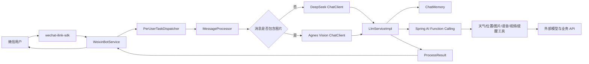

# YKD Bot

基于 Spring Boot、Spring AI 和微信 iLink SDK 构建的多模态微信智能机器人。

用户可以直接在微信中进行 AI 对话、图片识别、图片和视频生成、语音回复、天气查询、位置记录、附近搜索、路线规划以及定时提醒。

## 核心功能

| 功能 | 实现方式 |
|---|---|
| 普通聊天 | Spring AI 调用 DeepSeek `deepseek-chat` |
| 图片识别 | Agnes `agnes-2.0-flash` 多模态模型 |
| 图片生成 | Spring AI `ImageModel` 调用 `agnes-image-2.1-flash` |
| 视频生成 | Agnes Video API，后台异步轮询并主动推送 |
| 语音输入 | 读取微信 iLink 提供的语音转写文本 |
| 语音回复 | ElevenLabs TTS 生成 MP3 文件并发送到微信 |
| 天气查询 | 高德天气 API，支持实时天气和天气预报 |
| 位置服务 | 保存用户位置、当前位置天气、附近地点搜索 |
| 路线规划 | 高德步行和驾车路线规划 API |
| 定时提醒 | 支持延时提醒、每日提醒、查询和取消提醒 |
| 对话记忆 | 按微信用户隔离的 40 条滑动窗口记忆 |
| 微信登录 | iLink 扫码登录和本地 Session 恢复 |
| Web 管理 | 浏览器扫码登录、查看状态和断开连接 |

## 系统架构



项目通过 Spring AI 的 `@Tool` 和 Function Calling 让大模型理解用户意图。普通问题由模型直接回答；天气、位置、图片、语音、视频和提醒等请求由模型选择对应工具执行，不需要在消息入口编写大量 `if-else`。

## 技术栈

| 类型 | 技术/版本 |
|---|---|
| Java | JDK 21 |
| 应用框架 | Spring Boot 4.1.0 |
| AI 框架 | Spring AI 2.0.0 |
| 构建工具 | Maven Wrapper |
| 微信接入 | `wechat-ilink-sdk` 2.3.3 |
| 文本模型 | DeepSeek |
| 视觉/图片/视频 | Agnes AI |
| 语音合成 | ElevenLabs |
| 天气与位置 | 高德开放平台 |
| 并发处理 | Java 线程池、按用户串行队列 |

## 环境要求

- Windows 10/11（当前项目包含 Windows 使用的 SILK 工具）
- JDK 21
- 可访问模型和业务 API 的网络环境
- DeepSeek API Key
- Agnes/OpenAI 兼容 API Key
- ElevenLabs API Key
- 高德 Web 服务 API Key
- 可扫码登录的微信账号

检查 Java：

```powershell
java -version
```

输出的主版本必须是 `21`。

## 快速开始

### 1. 获取代码

```powershell
git clone git@github.com:Bolok-code/Ykd_Repository.git
cd Ykd_Repository
```

### 2. 创建本地配置

复制配置模板：

```powershell
Copy-Item config\application-local.yml.example config\application-local.yml
```

在 `config/application-local.yml` 中填写自己的密钥：

```yaml
spring:
  ai:
    openai:
      api-key: your-agnes-api-key
    deepseek:
      api-key: your-deepseek-api-key
    elevenlabs:
      api-key: your-elevenlabs-api-key

gaode:
  key: your-gaode-api-key
```

`config/application-local.yml` 已加入 `.gitignore`，禁止将真实密钥提交到 GitHub。当前版本的聊天和位置记忆使用内存存储，运行项目不依赖 MySQL；模板中的数据库配置可以暂不填写。

### 3. 编译和测试

```powershell
.\mvnw.cmd test
```

### 4. 启动项目

```powershell
.\mvnw.cmd spring-boot:run
```

启动成功后访问：

```text
http://localhost:8080
```

在管理页面点击“扫码登录”，使用微信扫描二维码。登录后的 Session 保存到：

```text
work/ilink-session.json
```

程序重启后会尝试恢复 Session；Session 过期时需要重新扫码。

## 使用示例

在微信中可以直接发送自然语言：

```text
介绍一下杭州西湖
帮我看看这张图片里有什么
生成一张赛博朋克风格的杭州夜景
用女声朗读：欢迎使用 YKD Bot
查询明天杭州天气
我现在在杭州西湖区
附近有什么咖啡店
从我这里步行去杭州东站
10 分钟后提醒我开会
```

位置相关功能需要先告诉机器人当前位置，例如：

```text
我现在在杭州西湖区
```

当前位置保存在内存中，程序重启后需要重新设置。

## 项目结构

```text
Ykd_Repository/
├── config/
│   ├── application-local.yml.example   # 本地配置模板
│   └── application-local.yml           # 本地真实配置，不提交
├── doc/
│   ├── technical-documentation.md      # 技术文档
│   └── 团队-Git-协作规范.md             # 团队协作规范
├── src/main/java/ykd/ykd/
│   ├── exception/                      # 错误码和异常处理
│   ├── llm/
│   │   ├── config/                     # Spring AI ChatClient 配置
│   │   ├── service/                    # 模型与媒体服务
│   │   └── tools/                      # Function Calling 工具
│   ├── location/                       # 高德位置、搜索和路线规划
│   ├── memory/                         # 对话记忆
│   ├── processor/                      # 消息编排、并发和异步任务
│   ├── weather/                        # 天气查询
│   ├── wxbot/                          # 微信登录、轮询和消息发送
│   └── YkdApplication.java             # Spring Boot 启动类
├── src/main/resources/
│   ├── application.yml                 # 公共配置
│   ├── static/index.html               # Web 管理页面
│   └── native/                         # SILK 编解码工具
├── pom.xml
└── README.md
```

## 核心调用链路

```text
微信消息
→ WeixinBotService.getUpdates()
→ PerUserTaskDispatcher.submit(userId)
→ MessageProcessor 提取文字、图片或语音转写
→ 选择 DeepSeek 或 Agnes ChatClient
→ LlmServiceImpl 加载对话记忆并注册 @Tool
→ 大模型直接回答或调用业务工具
→ ProcessResult 封装 TEXT/IMAGE/VOICE/VIDEO
→ WeixinBotService 通过 iLink 发送给用户
```

同一用户的消息串行处理，不同用户可以并行处理，从而保证上下文顺序正确，同时提高多用户场景的吞吐量。

## 配置安全

以下内容禁止提交：

- API Key；
- `config/application-local.yml`；
- `work/ilink-session.json`；
- 微信登录凭证；
- `.env`；
- 临时音频、图片、视频；
- `target/` 构建产物。

如果密钥曾经进入 Git 提交、截图或公开聊天，应立即在对应平台作废并重新生成。删除当前文件不能清除 Git 历史中的密钥。

## 当前说明

- 对话记忆使用 `InMemoryChatMemoryRepository`，最多保存最近 40 条消息，重启后丢失；
- 用户位置使用 `ConcurrentHashMap` 保存，重启后丢失；
- 语音回复目前以 MP3 文件发送，不是微信原生语音气泡；
- 图片、视频等外部模型能力取决于账号权限、额度和模型可用性。

## 团队协作

`main` 已配置分支保护规则。所有成员必须按照以下流程提交代码：

```text
从最新 main 创建个人功能分支
→ 开发并运行测试
→ 推送个人分支
→ 创建 Pull Request
→ 至少一名其他成员审核
→ 合并到 main
```

详细规则请阅读：

- [Git 与 GitHub 团队协作规范](doc/团队-Git-协作规范.md)
- [项目技术文档](doc/technical-documentation.md)
