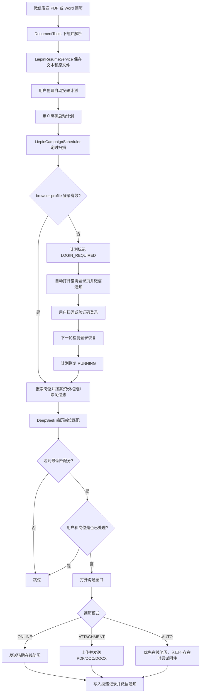

# 猎聘求职助手适配说明

## 功能范围

当前版本同时支持两条流程：

- 人工确认模式：搜索并匹配岗位，微信返回候选列表，用户确认某一项后才点击“聊一聊”；
- 全自动投递模式：按计划周期搜索、DeepSeek 匹配、阈值过滤、去重并发送在线简历或附件简历。

自动模式默认关闭，必须同时配置 `LIEPIN_ENABLED=true` 和 `LIEPIN_AUTO_APPLY_ENABLED=true`，并由用户在微信中明确创建和启动计划。

## 全自动流程



所有 Playwright 操作都在 `liepin-job-worker` 单线程执行，防止浏览器对象跨线程失效，也避免多个任务同时抢同一个页面。

## 安全与稳定性规则

- 自动计划按 `user_id + external_job_key` 去重，同一用户不会重复处理同一岗位；
- 只统计当天真正新发送成功的简历，并执行每日上限；
- AI 匹配失败时自动模式直接跳过，不能使用降级分数投递；
- 连续失败达到阈值后自动暂停；
- 登录过期、验证码或风控出现时暂停，不绕过安全验证；
- 登录恢复后自动继续暂停前的计划；
- 页面入口不明确时记录失败，不盲目点击未知按钮。

## 配置

在 `config/application-local.yml` 中配置：

```yaml
liepin:
  enabled: true
  headless: false
  profile-directory: ./work/liepin/browser-profile
  resume-directory: ./work/liepin/resumes
  auto-apply:
    enabled: true
    scan-interval-ms: 60000
    default-daily-limit: 3
    max-daily-limit: 20
    default-min-match-score: 85
    default-interval-minutes: 30
    max-consecutive-failures: 3
```

首次使用保持 `headless: false`。登录资料保存在 `work/liepin/browser-profile/`，简历原文件保存在 `work/liepin/resumes/`，两者都属于本地运行数据，不得提交 Git。

## 微信测试顺序

先用低限额测试，不要一开始就开大批量：

```text
1. 发送自己的 PDF 或 Word 简历
2. 把刚才的文件设为猎聘求职简历
3. 打开猎聘登录页面
4. 完成扫码登录
5. 检查猎聘登录状态
6. 创建猎聘自动投递计划：杭州 Java 后端，最低15K，匹配分85，每天1个，每30分钟执行，排除外包，使用在线简历
7. 启动猎聘自动投递
8. 查看猎聘自动投递状态
9. 查看猎聘自动投递记录
10. 测试暂停、继续启动和停止
```

真实发送前，建议先检查猎聘在线简历、附件简历和默认招呼语。测试代码不会向真实岗位发起投递，真实页面链路需由账号本人小范围验收。

## 数据表

- `liepin_resume`：简历文本；
- `liepin_resume_asset`：原始 PDF/Word 附件的文件路径、哈希和大小；
- `liepin_job_campaign`：自动投递计划、阈值、限额和状态；
- `liepin_job_task`：每轮搜索和分析任务；
- `liepin_job_posting`：职位、公司、招聘者、匹配分数和处理状态；
- `liepin_application_record`：岗位去重键、投递方式、结果、失败原因和时间。

## 参考与许可证

猎聘页面搜索、职位解析、卡片悬停和“聊一聊”流程改编自 [loks666/get_jobs](https://github.com/loks666/get_jobs)。原项目 Copyright (c) 2024 GET JOBS，采用 `GETJOBS-NC-1.0` 非商业许可证；当前改编仅用于非商业学习，许可文本见 [`doc/licenses/GETJOBS-NC-1.0.txt`](licenses/GETJOBS-NC-1.0.txt)。商业使用前必须获得原作者授权。

本项目没有实现浏览器指纹伪装、验证码绕过或风控绕过。

## 已知限制

- 猎聘页面改版后可能需要更新 `LiepinLocators`；
- 当前内置的是常用城市映射，其他地区应传猎聘城市代码；
- 附件上传依赖聊天窗口提供文件上传入口；
- “自动”模式只在在线简历入口不存在时尝试附件，不会在结果不确定时连续发送两种简历；
