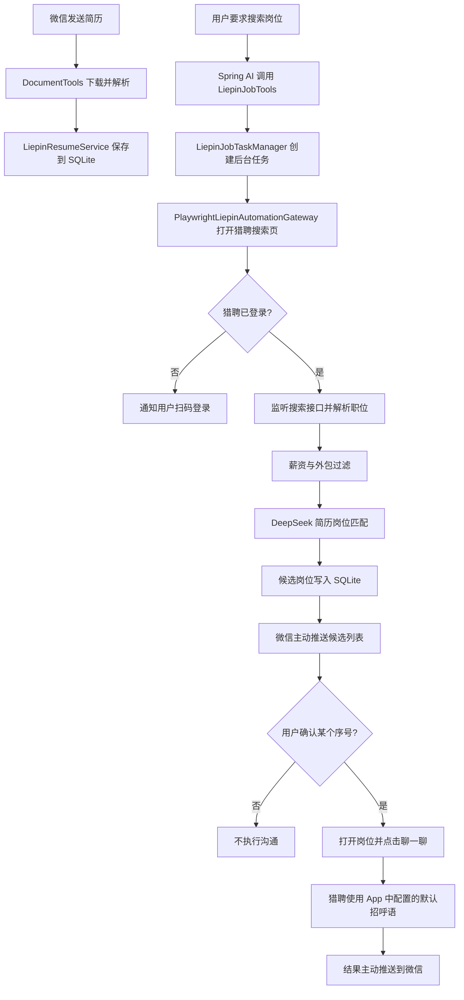

# 猎聘求职助手适配说明

## 实现范围

当前版本已经把原 Boss 浏览器适配替换为猎聘：

1. 微信接收并解析 PDF、Word、TXT 简历；
2. 简历文本保存到 SQLite，猎聘在线简历仍由用户在猎聘维护；
3. Playwright 使用独立的持久化浏览器目录，用户扫码一次后复用登录状态；
4. 搜索时监听猎聘职位接口响应，解析职位、公司和招聘者信息；
5. 按城市、薪资和外包关键词过滤，使用 DeepSeek 做简历匹配评分；
6. 后台任务完成后主动把候选岗位推送到微信；
7. 只有用户明确确认某个候选序号后，才进入该岗位并点击“聊一聊”。

程序不实现浏览器指纹伪装、验证码绕过或风控绕过。遇到登录失效、安全验证或页面结构变化时，任务会转为 `NEEDS_USER_ACTION` 并通知用户手动处理。

## 参考来源与差异

猎聘页面流程参考了开源项目 [loks666/get_jobs](https://github.com/loks666/get_jobs) 中的猎聘适配思路，包括：

- `LiepinConfig` 的关键词、城市代码和薪资参数；
- `Locators` 集中管理页面定位器；
- 监听 `com.liepin.searchfront4c.pc-search-job` 搜索响应；
- 从 `job`、`comp`、`recruiter` 节点提取职位信息；
- 使用持久化登录状态，并通过“聊一聊”发起沟通。

本项目没有逐字复制其源代码，而是按当前 Spring Boot、Spring AI、MyBatis、SQLite 和微信 iLink 架构重新实现。参考项目采用非商业许可证；如后续用于商业场景，应先单独核对许可证和平台规则。

本项目还增加了微信侧人工确认：搜索完成只返回候选列表，不会立即批量沟通。

## 运行流程



## 配置

`config/application-local.yml`：

```yaml
liepin:
  enabled: true
  headless: false
```

首次使用保持 `headless: false`，登录资料保存在：

```text
work/liepin/browser-profile/
```

该目录属于本地运行数据，不得提交到 Git。项目优先检测本机 Chrome 或 Edge，可用 `LIEPIN_BROWSER_EXECUTABLE` 指定浏览器路径。

猎聘“聊一聊”会使用猎聘 App 中配置的默认招呼语。请先在猎聘 App 内设置好默认招呼语，程序不会在点击之后再重复输入一遍。

## 微信测试顺序

```text
1. 发送自己的 PDF 或 Word 简历
2. 把刚才的文件设为求职简历
3. 打开猎聘登录页面
4. 在电脑弹出的浏览器中扫码登录
5. 检查猎聘登录状态
6. 帮我搜索杭州 Java 后端岗位，最低 15K，排除外包
7. 查看猎聘候选岗位
8. 确认投递第 1 个岗位
```

搜索和沟通操作统一放在 `liepin-job-worker` 单线程中执行，因为 Playwright 对象应由创建它的线程持续操作；这也避免多个任务同时抢同一个浏览器页面。

## 数据表

- `liepin_resume`：微信用户的简历文本；
- `liepin_job_task`：搜索、分析、确认与沟通任务状态；
- `liepin_job_posting`：职位、公司、招聘者、匹配分数及处理状态。

数据按微信 `user_id` 和任务 `task_id` 隔离。

## 当前限制

- 页面或搜索接口结构发生变化时，需要更新 `LiepinLocators` 或接口解析字段；
- 内置常用城市，也允许直接传猎聘城市代码；
- 每次只允许确认一个候选岗位；
- 不自动上传猎聘附件简历；
- 不处理验证码、滑块和其他安全验证绕过；
- 真实沟通前必须人工检查岗位、在线简历和默认招呼语。